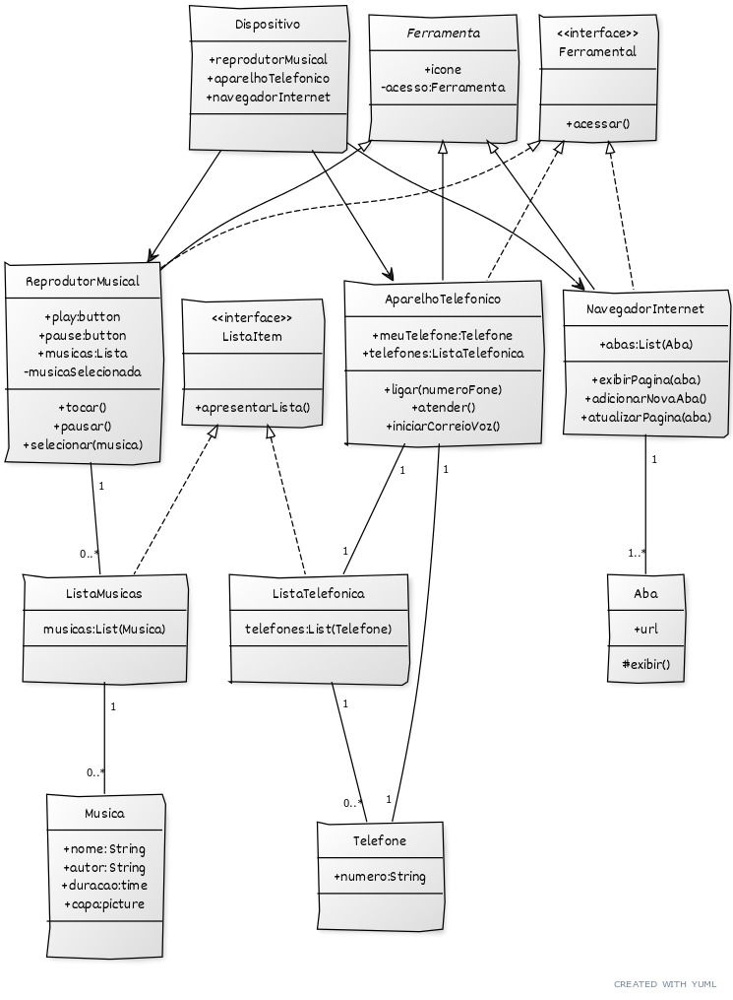

Execução do [POO Desafio](https://github.com/digitalinnovationone/trilha-java-basico/tree/main/desafios/poo) realizado por Edu Quaglia.

## Acesso ao código e testes
Executar [App.java](src/App.java)
## Diagrama de Classes

